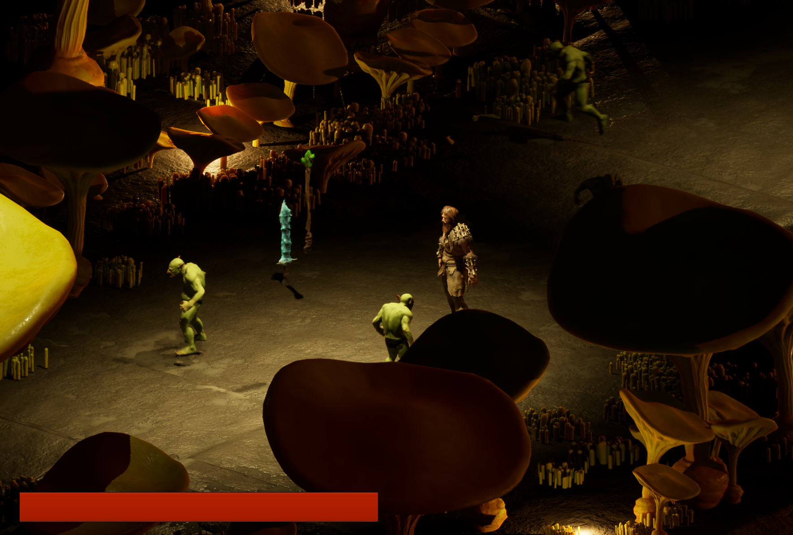
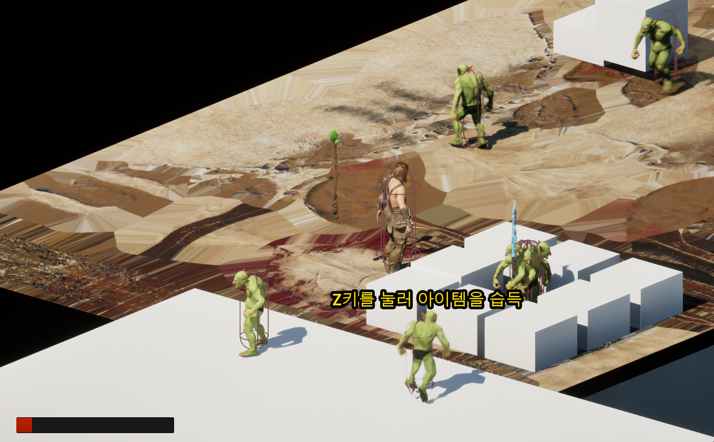
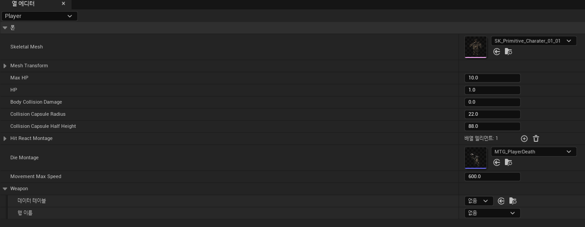
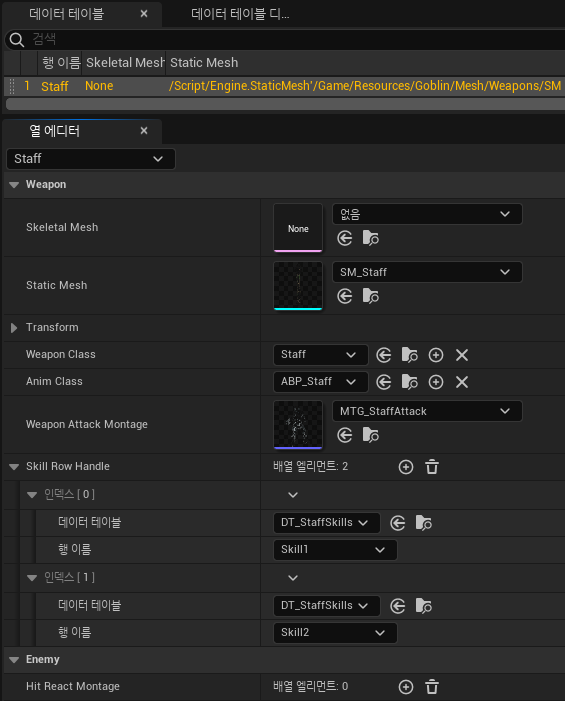
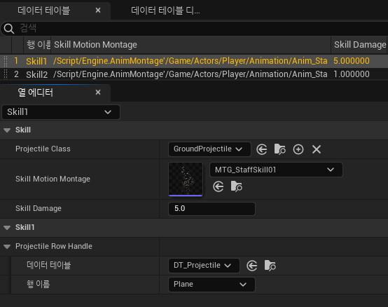
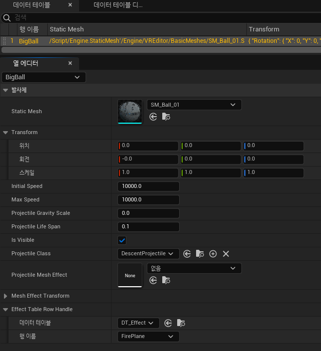
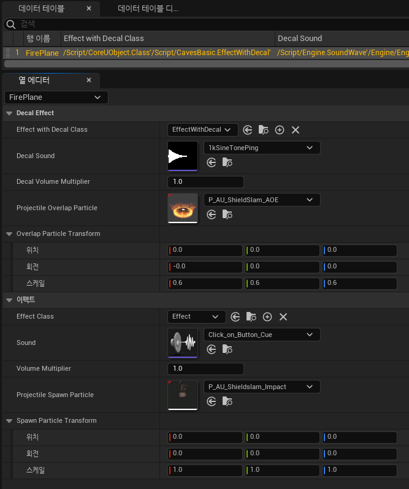

# CavesBasic 개인 프로젝트
## 🎮 프로젝트 개요
| 항목        | 내용                              |
|-------------|-----------------------------------|
| **장르**        | 탑다운 판타지 RPG                 |
| **컨셉**        | 어두운 동굴 속 전투와 생존         |
| **목표**        | C++ & Unreal Engine 5.4 기반 핵심 RPG 시스템 구현 |
| **기간**        | 2024.10.15 ~ 2024.11.15           |
| **개발자**      | 원재민                            |


 <br></br>

---

## 🛠️ 기술 스택
- **언어** : C++
- **게임 엔진** : Unreal Engine 5.4
- **버전 관리** : Sourcetree, GitHub
- **IDE** : Visual Studio 2022

---

## ⚡ 빌드 및 실행 방법

1. **필수 환경**
   - Unreal Engine 5.4
   - Visual Studio 2022
   - Windows 10/11 64bit

2. **프로젝트 다운로드**
    ```bash
    git clone https://github.com/WJMcode/Project_CavesBasic.git
    ```

3. **프로젝트 열기**
   - `CavesBasic.uproject` 더블클릭 또는 언리얼 에디터에서 직접 열기

4. **빌드**
   - `Generate Visual Studio Project files` 후, Visual Studio에서 빌드

5. **실행**
   - 언리얼 에디터에서 `Play` 클릭

---

## ✨ 주요 기능 요약

- **Player**
  - 4방향 이동, 점프, 웅크리기, 스킬 사용(무기별)
  - 피격 시 무적 & 깜빡임, 사망 시 리스폰
- **Projectile**
  - **Ground Projectile** : 땅 위에서만 생성되는 발사체로, 플레이어 전방의 지형을 감지해 스킬이 동작
  - **Straight Projectile** : 적을 추적하는 일직선 발사체
- **Monster**
  - 랜덤 AI 움직임, 사망 시 투명화 연출 및 제거(머티리얼 동적 교체, 자연스러운 사망 효과)
- **UI**
  - 플레이어/몬스터 체력바, 사망 리스폰 창
- **DataTable 기반 데이터 관리**  
  - 캐릭터, 무기, 스킬, 투사체, 이펙트 등 확장 가능한 구조, 에디터에서 실시간 관리

---

## 💡 설계 포인트

- **데이터 기반 구조**로 설계하여 캐릭터/몬스터/스킬 등 데이터 확장 용이
- **Blueprint & C++ 혼용**으로 직관성과 성능 모두 확보
- **하드코딩 최소화**, **에디터 친화적 구조**

---

## 🧠 프로젝트 구조

```text
Project_CavesBasic/
├── Source/CavesBasic/
│   ├── Actors/         # 플레이어, 몬스터 등 주요 액터
│   ├── Components/     # 플레이어 상태 등 기능별 컴포넌트
│   ├── UI/             # 위젯, HUD
│   └── GameframeWork/  # GameMode 등
├── Config/
├── Content/
├── CavesBasic.uproject
└── README.md
```
---

## ⚠️ 트러블슈팅
- **Straight Projectile 추적 문제**
  - **문제 배경** : Straight Projectile이 몬스터 가까이에서 생성될 때, 몬스터를 제대로 추적하지 못했습니다.
  - **원인** : 몬스터의 방향이 아니라 위치만 추적하여, 발사체가 올바르게 따라가지 못한 것이 원인이었습니다.
  - **해결 과정** : Tick마다 몬스터의 방향을 체크하고, 발사체를 해당 방향으로 회전시키도록 수정하였습니다.
  - **결과** : 발사체가 몬스터를 지속적으로 정확히 추적해 자연스러운 타격이 가능해졌습니다.

- **몬스터 사망 시 투명화 효과 구현 실패**
  - **문제 배경** : 몬스터 사망 시 점점 투명해지는 효과를 구현하려 했으나, 머티리얼의 Opacity 조정이 불가능했습니다.
  - **원인** : 기존 머티리얼의 블렌드 모드가 Opaque로 설정되어 있었습니다.
  - **시도** : Opacity를 수정할 수 있도록 블렌드 모드를 바꾸어 적용하였으나, 몬스터 외형의 퀄리티가 떨어졌습니다.
  - **해결 과정** : 블렌드 모드가 Translucent인 머티리얼을 별도로 만들어 사망 시에만 교체하고, Opacity 값을 점차 낮추는 방식으로 수정했습니다.
  - **결과** : 몬스터가 사망할 때 자연스럽게 투명해지며 사라지는 효과를 구현할 수 있었습니다.

---
 
## 🔎 세부 구현 (주요 코드/로직)

### 1. Player

  - Weapon을 습득한 Player는 Skill 사용 가능
    
      <details>
        <summary> OnSkill 함수 코드 ( Skill 실행 코드 )</summary>
    
     

    
       ```cpp
       /* Player가 키 입력을 통해 Skill을 사용하면 OnSkill 함수가 호출됩니다.
        * 기본적으로 Player가 웅크리지 않은 상태에서만 OnSkill 함수가 실행됩니다.
        * Weapon은 에디터 내에 존재하는 Weapon 전용 InputMappingContext를 통해
        * Skill InputAction들을 바인딩하고 있습니다.
        * OnSkill 함수가 호출되는 시점에 어떤 Skill InputAction이 들어왔는지 체크합니다.
        * ( 이때 InputAction 파일의 이름 규칙은 "IA_Skill*"이며 *은 1부터 시작하는 Skill 번호입니다. )
        * 체크한 Skill InputAction의 번호를 통해 Weapon 데이터 테이블이 저장하고 있는
        * Skill 데이터 테이블의 행에 접근합니다.
        * Skill 데이터 테이블에는 *번 스킬이 실행될 때 재생되는 몽타주가 저장되어 있어 해당 몽타주를 재생합니다.
        */
	void AWeaponBase::OnSkill(const FInputActionInstance& Instance)
	{
	    ACharacter* OwningCharacter = Cast<ACharacter>(OwningPawn);
       	    // 캐릭터가 웅크리지 않은 상태라면
	    if (!OwningCharacter->bIsCrouched)
	    {
		// 호출된 InputAction을 통해 어떤 키가 입력되었는지 확인
		const UInputAction* TriggeredAction = Instance.GetSourceAction();
		FString ActionName = TriggeredAction->GetName();
		// 스킬 번호만 남김
		ActionName.RemoveFromStart(TEXT("IA_Skill"));
		int32 ExecutedSkillNum = FCString::Atoi(*ActionName);
	
		// 어떤 키가 입력되었느냐에 따라 다른 스킬을 실행함
		const FString Skill_Number = TEXT("Skill") + FString::FromInt(ExecutedSkillNum);
	
		if (SkillRowHandleNum >= ExecutedSkillNum)
		{
		    FSkillTableRow* SkillRow = WeaponTableRow->SkillRowHandle[ExecutedSkillNum - 1].GetRow<FSkillTableRow>(Skill_Number);
	
		    if (!SkillRow) { ensure(false); return; }
	
		    UAnimMontage* CurrentMontage = BasicAnimInstance->GetCurrentActiveMontage();
	
		    // 현재 몽타주가 재생 중이지 않을 때
		    if (nullptr == CurrentMontage)
		    {
			if (ABasicPlayer* WeaponOwner = Cast<ABasicPlayer>(OwningCharacter))
			{
			    UStatusComponent* StatusComponent = WeaponOwner->GetComponentByClass<UStatusComponent>();
			    if (StatusComponent->IsPlayer())
			    {
				UAnimMontage* PlayingMontage = WeaponOwner->GetPlayingMontage();
				if (PlayingMontage)
				{
				    WeaponOwner->SetPlayingMontage(nullptr);
				}
	
				// 스킬 데이터 테이블에 있는 몽타주를 재생
				WeaponOwner->SetPlayingMontage(SkillRow->SkillMotionMontage);
			    }
			    else
			    {
				if (ADefaultMonster* WeaponOwnerIsMonster = Cast<ADefaultMonster>(OwningCharacter))
				{
				    UAnimMontage* PlayingMontage = WeaponOwnerIsMonster->GetPlayingMontage();
				    if (PlayingMontage)
				    {
					WeaponOwnerIsMonster->SetPlayingMontage(nullptr);
				    }
				    WeaponOwnerIsMonster->SetPlayingMontage(SkillRow->SkillMotionMontage);
				}
			    }
			}
			BasicAnimInstance->Montage_Play(SkillRow->SkillMotionMontage);
		    }
		}
	    }
	}
       ```
      </details><br>


  - Projectile이 **Ground Projectile**로 설정된 Skill 사용 시
<br></br>
**Ground Projectile**은 Player 앞에 땅이 있어야 생성되는 발사체.<br>
Player를 중심( 캐릭터의 배꼽 위치 )을 기준으로 전방에 바닥이 존재한다면<br>
Ground Projectile이 생성되고, 바닥이 없다면 생성되지 않습니다.
<br></br>


      <details>
        <summary> AGroundProjectile 클래스의 BeginPlay 함수 코드 ( GroundProjectile의 생성 위치를 조정 )</summary>
    
     

    
       ```cpp
       /* Skill 데이터 테이블에서 Projectile 설정이 GroundProjectile로 설정된 Skill을 사용하면 GroundProjectile 객체가 생성됩니다.
        * GroundProjectile은 Player의 중심을 기준으로, Skill 데이터 테이블에서 설정한 Transform값을 포함한 위치에 생성됩니다.
        * GroundProjectile이 생성되면 GroundProjectile 위치 기준, 아래 방향으로 LineTrace를 발사하여 오브젝트를 감지합니다.
        * Collision이 Floor로 설정된 오브젝트가 감지되었다면 감지된 오브젝트 위로 GroundProjectile을 옮깁니다.
        * 만약 Collision이 Floor로 설정된 오브젝트가 아닌, 다른 오브젝트가 감지되거나 아무것도 감지되지 않으면
        * 위쪽 방향으로 LineTrace를 발사하여 오브젝트를 감지합니다.
        * 마찬가지로 Collision이 Floor로 설정된 오브젝트가 감지되었다면 감지된 오브젝트 위로 GroundProjectile을 옮깁니다.
        * 이 경우에도 아무것도 감지되지 않으면 GroundProjectile을 Destroy합니다.                     
        */
	void AGroundProjectile::BeginPlay()
	{
		Super::BeginPlay();
	
		// GroundProjectile의 위치 얻어오기
		FVector GroundProjectileLocation = GetActorLocation();
		// 아래 방향으로 LineTrace를 발사
		FHitResult DownHitResult;
		{
			TArray<AActor*> IgnoreActors; IgnoreActors.Add(GetOwner());
	
			// 해당 Trace는 FloorDetectTraceChannel로 발사되는 Trace이다. 
			// 발사된 해당 Trace는 Collision이 Floor로 설정된 오브젝트를 감지한다.
			// Floor로 설정된 오브젝트에만 GroundProjectile 스킬을 스폰시키는 것이 목적.
			const ETraceTypeQuery TraceTypeQuery = UEngineTypes::ConvertToTraceType(ECollisionChannel::ECC_GameTraceChannel5);
			const bool bHit = UKismetSystemLibrary::LineTraceSingle(GetWorld(),
				GetActorLocation(), GetActorLocation() + FVector(0, 0, -350), TraceTypeQuery,
				false, IgnoreActors, EDrawDebugTrace::ForDuration, DownHitResult, true);
			// 만약 Hit가 발생했다면 그 위치로 GroundProjectile을 옮김
			if (bHit)
			{
				GroundProjectileLocation.Z = DownHitResult.ImpactPoint.Z;
				SetActorLocation(GroundProjectileLocation);
	
				return;
			}
		}
		// 위쪽 방향으로 LineTrace를 발사
		FHitResult UpHitResult;
		{
			TArray<AActor*> IgnoreActors; IgnoreActors.Add(GetOwner());
	
			const ETraceTypeQuery TraceTypeQuery = UEngineTypes::ConvertToTraceType(ECollisionChannel::ECC_GameTraceChannel5);
			const bool bHit = UKismetSystemLibrary::LineTraceSingle(GetWorld(),
				GetActorLocation(), GetActorLocation() + FVector(0, 0, 200), TraceTypeQuery,
				false, IgnoreActors, EDrawDebugTrace::ForDuration, UpHitResult, true);
	
			if (bHit)
			{
				GroundProjectileLocation.Z = UpHitResult.ImpactPoint.Z;
				SetActorLocation(GroundProjectileLocation);
				
				return;
			}
		}
		
		// Floor가 감지되지 않으면 GroundProjectile을 그냥 제거한다.
		Destroy();
	}
 	```
      </details>

 
      <details>
        <summary> AGroundProjectile 클래스의 OnBeginOverlap 함수 코드 ( GroundProjectile이 다른 오브젝트와 접촉할 시 호출 )</summary>
    
     

    
       ```cpp
       /* GroundProjectile과 Collision이 Floor로 설정된 오브젝트가 접촉하면 Decal Effect를 생성합니다.
        * 접촉했다면 DetectDamageTarget 함수를 호출합니다.
        * DetectDamageTarget 함수는 BoxTrace를 발사하여 데미지를 적용할 수 있는 오브젝트가 있는지 체크하는 함수입니다.
        * 이후 GroundProjectile을 파괴합니다.
        * 데미지를 적용할 수 있는 오브젝트가 존재한다면, UGameplayStatics의 ApplyDamage 함수를 호출하여 데미지를 적용합니다.
        */
	void AGroundProjectile::OnBeginOverlap(UPrimitiveComponent* OverlappedComponent, AActor* OtherActor, UPrimitiveComponent* OtherComp, int32 OtherBodyIndex, bool bFromSweep, const FHitResult& SweepResult)
	{
		if (!IsValid(this)) { return; }
		
		FTransform NewTransform = GetActorTransform();
		
		// DecalEffect 출력
		{
			FProjectileTableRow* EffectTableRow = DataTableRowHandle.GetRow<FProjectileTableRow>(TEXT("Effect"));
			FEffectDecalTableRow* DecalEffectTableRow = EffectTableRow->EffectTableRowHandle.GetRow<FEffectDecalTableRow>(TEXT("DecalEffect"));
	
			AEffectWithDecal* DecalEffect = GetWorld()->SpawnActorDeferred<AEffectWithDecal>(DecalEffectTableRow->EffectWithDecalClass,
				FTransform::Identity);
	
			FDataTableRowHandle DecalTableRowHandle = EffectTableRow->EffectTableRowHandle;
	
			DecalEffect->SetData(DecalTableRowHandle);
			NewTransform.SetScale3D(DecalEffectTableRow->OverlapParticleTransform.GetScale3D());
			DecalEffect->FinishSpawning(NewTransform);
			// DecalEffect의 위치를 FinishSpawning 함수를 통해 조정하는 것일 뿐,
			// Play 함수를 호출하면 원점에 무조건 DecalEffect가 출력된다.
			DecalEffect->Play();
		}
	
		ABasicPlayer* OwningCharacter = Cast<ABasicPlayer>(GetOwner());
		check(OwningCharacter);
	
		// Skill Data Table 얻어오기
	  	// 스킬을 관리하는 배열에 접근하여 스킬 시전 애니메이션과
	  	// 플레이어가 재생 중인 스킬 시전 애니메이션과 같은 것을 찾아냄.
		// Notify를 발생시킨 애니메이션과 일치하는 애니메이션이 있는 스킬 배열의 인덱스를 저장하고 그 스킬 배열에 있는 데이터 테이블에 접근하여 반환
		const FSkillTableRow* SkillTableRow = OwningCharacter->GetSkillTableRow();
		ensure(SkillTableRow);
	
		// GroundProjectile이 Floor와 Overlap되면 
		// BoxTrace를 이용해 데미지를 줄 타겟을 감지한다.
		AActor* DetectActor = DetectDamageTarget();
	
		Destroy();
	
		// 타겟이 감지되었다면 데미지 주기
		if(DetectActor)
		{
			UGameplayStatics::ApplyDamage(DetectActor, SkillTableRow->SkillDamage, GetInstigator()->GetController(), this, nullptr);
		}
	}
	```
	</details><br>
      
  - Projectile이 **Straight Projectile**로 설정된 Skill 사용 시
<br></br>
**Straight Projectile**은 Player를 중심으로 일직선으로 발사되는 Projectile.<br>
Straight Projectile이 날아가는 동안 Projectile 주변에 몬스터가 있는지 감지.<br>
몬스터가 감지되었다면 해당 몬스터쪽으로 날아갑니다.
<br></br>


      <details>
        <summary> AStraightProjectile 클래스의 BeginPlay 함수와 DetectDamageTarget 함수 코드 ( Straight Projectile 생성 시, 범위 내 몬스터를 감지 ) </summary>
    
     

    
       ```cpp
       /* Straight Projectile이 생성되면 AStraightProjectile 클래스의 BeginPlay 함수가 호출됩니다.
        * BeginPlay 함수는 DetectDamageTarget 함수를 호출하여 반환값을 DetectActor에 저장합니다.
        * DetectDamageTarget 함수는 감지된 몬스터를 반환하는 함수입니다.
        * Straight Projectile의 이동 경로 근처에 Collision이 몬스터로 설정된 오브젝트가 있는지 Box Trace를 통해 감지합니다.
        * 감지되었다면 해당 오브젝트를 가리키는 포인터를 반환하고 DetectDamageTarget 함수를 종료합니다.
        */
	void AStraightProjectile::BeginPlay()
	{
		Super::BeginPlay();
	
		DetectActor = DetectDamageTarget();
	}
	
	AActor* AStraightProjectile::DetectDamageTarget()
	{
		FHitResult DetectResult;
		{
		TArray<AActor*> IgnoreActors; IgnoreActors.Add(GetOwner());
	
			FVector TraceStartLocation = GetActorLocation();  // Trace 시작 위치
			FVector TraceDirection = GetActorForwardVector();  // 예: 전방 벡터 (정확한 방향은 상황에 따라 다를 수 있음)
	
			// 새로운 위치 계산
			FVector TraceEndLocation = TraceStartLocation + (TraceDirection * Distance);
	
			// StraightProjectile의 크기를 얻어와서 
			FVector Origin;
			FVector BoxExtent;
			GetActorBounds(false, Origin, BoxExtent);
			
			// Projectile의 자식으로 붙어있는 파티클 시스템의 크기는 빼준다.
			if (ProjectileMeshEffectComponent)
			{
				// 파티클 시스템의 크기 계산
				FBox ParticleBounds = ProjectileMeshEffectComponent->Bounds.GetBox();
				FVector ParticleExtent = ParticleBounds.GetExtent();
	
				// 파티클 시스템 크기를 반영하지 않으려면 BoxExtent에서 빼기
				BoxExtent -= ParticleExtent;
			}
	
			// 감지 범위 조절
			BoxExtent.Y += 50;
			BoxExtent.Z += 150;
			FVector DetectRange = BoxExtent;
	
		     //해당 Trace는 MonsterDetectTraceChannel로 발사되는 Trace이다. 
			// 발사된 해당 Trace는 Collision이 Monster로 설정된 오브젝트를 감지한다.
			const ETraceTypeQuery TraceTypeQuery = UEngineTypes::ConvertToTraceType(ECollisionChannel::ECC_GameTraceChannel8);
			const bool bHit = UKismetSystemLibrary::BoxTraceSingle(GetWorld(),
				TraceStartLocation, TraceEndLocation, DetectRange, GetOwner()->GetActorRotation(), TraceTypeQuery,
				false, IgnoreActors, EDrawDebugTrace::ForDuration, DetectResult, true);	
	
			if (bHit)
			{
				AActor* TraceDetectActor = DetectResult.GetActor();
	
				if (TraceDetectActor)
				{
					return TraceDetectActor;
				}
			}
		}
		return nullptr;
	}
	```
	</details>

 
      <details>
        <summary> AStraightProjectile 클래스의 Tick 함수와 FollowDamageTarget 함수 코드 ( Straight Projectile이, 감지한 몬스터 쪽으로 이동 ) </summary>
    
     

    
       ```cpp
       /* Straight Projectile이 존재하는 동안 AStraightProjectile 클래스의 Tick 함수가 호출됩니다.
        * Tick 함수에서는 멤버 포인터인 DetectActor가 가리키는 오브젝트가 존재한다면, FollowDamageTarget 함수를 호출합니다.
        * FollowDamageTarget 함수는 인자로 받은 오브젝트(몬스터)를 Straight Projectile이 따라갈 수 있도록 하는 함수입니다.
        * FollowDamageTarget 함수가 호출될 때마다 따라가야 하는 오브젝트가 어떤 방향에 존재하는지 계속 체크합니다.
        * 그리고 Straight Projectile을 해당 방향으로 회전시킵니다.
        * Straight Projectile은 생성 시 일정한 방향으로 이동하고 속도(Velocity)도 이미 설정되어 있으므로, 
        * FollowDamageTarget 함수에서 방향만 설정해주어도 발사체가 타겟으로 이동하게 됩니다.
        */
	void AStraightProjectile::Tick(float DeltaTime)
	{
		Super::Tick(DeltaTime);
	
		if (DetectActor)
		{
			FollowDamageTarget(DetectActor);
		}
	}
	
	void AStraightProjectile::FollowDamageTarget(AActor* TargetActor)
	{
		// 감지된 Actor를 따라가는 함수
		// 타겟 방향을 계산.
		FVector DirectionToTarget = (TargetActor->GetActorLocation() - GetActorLocation()).GetSafeNormal();
	
		// 발사체를 타겟 방향으로 회전시킴.
		FRotator NewRotation = DirectionToTarget.Rotation();
		SetActorRotation(NewRotation);
	
		ProjectileMovementComponent->Velocity = DirectionToTarget * ProjectileData->InitialSpeed;
	}
	```
	</details><br>

      
  - Player 피격 시, Overlay Material의 Opacity 값을 조정하여 깜빡이는 효과 부여 
<br></br>


      <details>
        <summary> UCharacterMeshEffect 클래스의 ApplyHitMaterial 함수 코드 ( UCharacterMeshEffect는 Player의 메시에 효과를 주기 위한 클래스 ) </summary>
    
     

    
       ```cpp
       /* Player의 메시는 오버레이 머티리얼을 가지고 있습니다.
        * Player가 피격될 경우 오버레이 머티리얼의 HitOverlayOpacity라는 Parameter의 값을 변경합니다.
        * 기본적으로 HitOverlayOpacity의 값은 0이며, 피격될 경우 0.6으로 값이 설정되어 Player의 메시가 보라색이 됩니다.
        * 이후 HitOverlayOpacity의 값을 다시 0으로, 그리고 0.6으로 설정하는 것을 반복하여 보라색으로 깜빡이는 효과를 줍니다.
        * Player가 사망하거나, 일정 시간이 지나면 HitOverlayOpacity의 값을 0으로 설정함으로써 깜빡임을 멈춥니다.
        */
	void UCharacterMeshEffect::ApplyHitMaterial(const float Duration)
	{
	    if (!OwningPlayer || !TargetMeshComponent)
	    {
	        UE_LOG(LogTemp, Warning, TEXT("OwningPlayer or MeshComponent is nullptr."));
	        return;
	    }
	
	    // 1. Overlay Material을 가져오기
	    OriginalOverlayMaterial = TargetMeshComponent->GetOverlayMaterial();
	
	    if (!OriginalOverlayMaterial)
	    {
	        UE_LOG(LogTemp, Warning, TEXT("OriginalOverlayMaterial is nullptr, 플레이어 Mesh에는 오버레이 머티리얼이 존재해야 합니다."));
	        return;
	    }
	    
	    // 2. Overlay Material을 동적 머티리얼 인스턴스로 변환
	    UMaterialInstanceDynamic* DynOverlayMaterial = UMaterialInstanceDynamic::Create(OriginalOverlayMaterial, this);
	
	    if (DynOverlayMaterial)
	    {
	        DynOverlayMaterial->SetScalarParameterValue("HitOverlayOpacity", 0.6f);
	        TargetMeshComponent->SetOverlayMaterial(DynOverlayMaterial);
	
	        // BlinkTimerHandle가 작동하고 있지 않을 때에만 아래 코드 실행
	        if (!GetWorld()->GetTimerManager().IsTimerActive(BlinkTimerHandle))
	        {
	            // (Duration / x.f)초마다 BlinkMaterial 함수를 호출함
	            GetWorld()->GetTimerManager().SetTimer(BlinkTimerHandle, [this, DynOverlayMaterial]()
	                {
	                    BlinkMaterial(DynOverlayMaterial);
	                }, Duration / 30.f, true);
	        }
	
	        // RestoreTimerHandle가 작동하고 있지 않을 때에만 아래 코드 실행
	        if (!GetWorld()->GetTimerManager().IsTimerActive(RestoreTimerHandle))
	        {
	            // OwningPlayer가 사망 상태라면 덜 깜빡임
	            if (OwningPlayer && OwningPlayer->GetStatusComponent()->IsDie())
	            {
	                // Duration / x초 후에 타이머를 멈추도록 설정
	                GetWorld()->GetTimerManager().SetTimer(RestoreTimerHandle, [this, DynOverlayMaterial]()
	                    {
	                        RestoreOriginalMaterial(DynOverlayMaterial);
	
	                        // 타이머 정지
	                        GetWorld()->GetTimerManager().ClearTimer(BlinkTimerHandle);
	                        GetWorld()->GetTimerManager().ClearTimer(RestoreTimerHandle);
	
	                        InitializeMembers();
	
	                    }, Duration / 3.f , false);
	            }
	            else
	            {
	                // Duration초 후에 타이머를 멈추도록 설정
	                GetWorld()->GetTimerManager().SetTimer(RestoreTimerHandle, [this, DynOverlayMaterial]()
	                    {
	                        RestoreOriginalMaterial(DynOverlayMaterial);
	
	                        // 타이머 정지
	                        GetWorld()->GetTimerManager().ClearTimer(BlinkTimerHandle);
	                        GetWorld()->GetTimerManager().ClearTimer(RestoreTimerHandle);
	
	                        InitializeMembers();
	
	                    }, Duration, false);
	            }
	        }
	    }
	}
	
	void UCharacterMeshEffect::BlinkMaterial(UMaterialInstanceDynamic* OutDynOverlayMaterial)
	{
	    if (BlinkCount % 2 == 0)
	    {
	        // HitOverlayOpacity값을 0.0f로 설정, 기본 상태랑 같음
	        OutDynOverlayMaterial->SetScalarParameterValue("HitOverlayOpacity", 0.0f);
	    }
	    else
	    {
	        // HitOverlayOpacity값을 0.6f로 설정, OverlayMaterial이 캐릭터에게 반투명 형태로 나타남
	        OutDynOverlayMaterial->SetScalarParameterValue("HitOverlayOpacity", 0.6f);
	    }
	
	    // 파라미터 변경 후 Overlay Material 재설정
	    TargetMeshComponent->SetOverlayMaterial(OutDynOverlayMaterial);
	
	    // BlinkCount 증가
	    ++BlinkCount;
	}
	
	void UCharacterMeshEffect::RestoreOriginalMaterial(UMaterialInstanceDynamic* OutDynOverlayMaterial)
	{
	    TargetMeshComponent->SetOverlayMaterial(OriginalOverlayMaterial);
	}
	
	void UCharacterMeshEffect::InitializeMembers()
	{
	
	    OriginalOverlayMaterial = nullptr;
	
	    BlinkCount = 0;
	    BlinkTimerHandle.Invalidate();
	    RestoreTimerHandle.Invalidate(); 
	}
	```
	</details><br>
                    


### 2. Monster
  - Monster 사망 시, Material을 교체하고 Opacity 값을 수정
                                <br><br>


      <details>
        <summary> ADefaultMonster 클래스의 BeginPlay와 OnDisappearMesh, OnDisappearMeshEnd 함수 코드 </summary>
    
     

    
       ```cpp
       /* 현재 Monster의 메시는 Opacity를 수정할 수 없는 메시로 설정되어 있습니다.
        * ADefaultMonster 클래스의 BeginPlay 함수에서
        * 멤버 변수 MaterialInstanceDynamics에 Opacity를 수정할 수 있는 Material을 저장합니다.
        * Monster 사망 시, OnDisappearMesh 함수를 호출하여
        * Monster의 메시를 MaterialInstanceDynamics에 저장된 Material로 교체하고 
        * Opacity를 조정합니다. 이로써 Monster의 메시가 점점 투명해지도록 연출할 수 있게 됩니다.
        * OnDisappearMesh 함수가 종료되면 OnDisappearMeshEnd 함수를 호출하여 Monster를 Destroy합니다.
        */
	void ADefaultMonster::BeginPlay()
	{
		Super::BeginPlay();
		
		SetData(DataTableRowHandle);
	
		USkeletalMeshComponent* SkeletalMeshComponent = GetComponentByClass<USkeletalMeshComponent>();
	
		// 1번 인덱스에 있는 Material이 BlendMode가 Translucent로 설정되어, Opacity를 수정할 수 있는 Material이다.
		// MaterialInstanceDynamics는 1번 인덱스에 있는 Material을 가리키는 멤버 변수
		MaterialInstanceDynamics = SkeletalMeshComponent->CreateAndSetMaterialInstanceDynamic(1);
		ensureMsgf(MaterialInstanceDynamics->GetBlendMode() == EBlendMode::BLEND_Translucent && MaterialInstanceDynamics, TEXT("1번 인덱스에 존재하는 Material이 없거나, BlendMode가 Translucent가 아닙니다."));
	
		if (DisappearCurve)	// DisappearCurve 값 세팅
		{
			// 몬스터 사망 모션은 하나로 함
			float DieMontagePlayLength = MonsterData->DieMontage->GetPlayLength();
			
			// 키프레임 추가
			FKeyHandle KeyHandle1 = DisappearCurve->FloatCurve.AddKey(0.0f, 1.0f);  // 시간 0에서 값 1
			// 값이 점점 증가하는 Curve
			FKeyHandle KeyHandle3 = DisappearCurve->FloatCurve.AddKey(DieMontagePlayLength, DieMontagePlayLength);  // 시간 DieMontagePlayLength에서 값 DieMontagePlayLength
	
			DisappearCurve->FloatCurve.SetKeyInterpMode(KeyHandle1, RCIM_Cubic);  // 선형 보간
			DisappearCurve->FloatCurve.SetKeyInterpMode(KeyHandle3, RCIM_Cubic);
		}
		FOnTimelineFloat Delegate;
		Delegate.BindDynamic(this, &ThisClass::OnDisappearMesh);
		// Delegate와 연동된, 즉 OnDisappearMesh 함수가 호출될 때 DisappearCurve를 인자로 넘긴다.
		DisappearTimelineComponent->AddInterpFloat(DisappearCurve, Delegate);
	
		FOnTimelineEvent EndDelegate;
		EndDelegate.BindDynamic(this, &ThisClass::OnDisappearMeshEnd);
		DisappearTimelineComponent->SetTimelineFinishedFunc(EndDelegate);
	
		...
	}

	void ADefaultMonster::OnDisappearMesh(float InDissolve)
	{
		if (MaterialInstanceDynamics)
		{
			USkeletalMeshComponent* SkeletalMeshComponent = GetComponentByClass<USkeletalMeshComponent>();
			// MaterialInstanceDynamics가 가리키고 있는, BlendMode가 Translucent로 설정된
			// Material을 Monster의 0번 Material로 설정해 준다.
			SkeletalMeshComponent->SetMaterial(0, MaterialInstanceDynamics);
	
			// CurrentTransparency의 초깃값은 1이다.
			float CurrentTransparency;
			MaterialInstanceDynamics->GetScalarParameterValue(FName("Opacity"), CurrentTransparency);
	
			float SpeedMultiplier = 0.005f; // 낮을수록 투명도 감소 속도를 더 천천히 만듭니다.
			
			// CurrentTransparency의 값을 점점 감소시켜 몬스터가 점점 투명해지도록 한다.
			float NewTransparency = FMath::Max(CurrentTransparency - InDissolve * SpeedMultiplier, 0.0f); // Max 함수는 첫 번째 인자의 값이 음수가 나오면 0.0f을 반환해 준다.
			MaterialInstanceDynamics->SetScalarParameterValue(FName("Opacity"), NewTransparency);
		}
	}
	
	void ADefaultMonster::OnDisappearMeshEnd()
	{
		Destroy();
	}
	```
	</details>

---

### 🖥️ UI
  - Player 사망 시 리스폰창 출력 및 리스폰 진행
                                <br><br>


---

### 📊 데이터 관리
  * **Player의 데이터**는 언리얼 엔진 에디터상에서 데이터 테이블로 세팅 가능
          <br><br>
  <br>  　　　　　　  　　　　　　  　　　　　　　**`Player 데이터 테이블`**<br>
	  
  * **Weapon의 데이터**는 언리얼 엔진 에디터상에서 데이터 테이블로 세팅 가능
    <br>
**Weapon 데이터 테이블**에서는 해당 Weapon이 보유할 Skill을 세팅해 줄 수 있습니다.<br><br>
<br>  　　　　　　  　　　　　　  **`Weapon 데이터 테이블`**<br><br><br>
**Skill 데이터 테이블**에서는 해당 Skill 사용 시 발사되는 Projectile을 세팅해 줄 수 있습니다.<br><br> <br>  　　　　　　  　　　　　　  **`Skill 데이터 테이블`**<br><br>
**Projectile 데이터 테이블**에서는 해당 Projectile의 크기와 스폰 위치를 세팅해 줄 수 있습니다.<br><br> <br>  　　　　　　  　　　　　　  **`Projectile 데이터 테이블`**<br><br>
**Effect 데이터 테이블**에서는 Projectile의 효과음과 Effect를 세팅해 줄 수 있습니다.<br><br> <br>  　　　　　　  　　　　　　    　　　**`Effect 데이터 테이블`**<br>

---

## 📝 참고 사항
- 빌드/실행 오류 발생 시 Content 경로 확인 필수
  
---

🧩 회고
- **데이터 기반 설계 경험**
발사체, 무기, 스킬, 이펙트 등 게임의 주요 요소를 DataTable로 관리하며 하드코딩을 최소화하고, 새로운 데이터 추가와 수정이 매우 편리한 구조를 직접 설계하고 구현해볼 수 있었습니다. 이를 통해 확장성과 유지보수성의 중요성을 체감했습니다.

- **트러블슈팅 역량 강화**
발사체 추적 로직, 머티리얼 블렌딩 등에서 다양한 문제를 직접 해결하면서 문제 분석력과 디버깅 실력이 크게 성장했다고 느꼈습니다.

- **개인 프로젝트의 주도적 완성**
설계, 구현, 테스트 및 디버깅, 문서화까지 모든 과정을 스스로 주도적으로 진행하며 실무와 유사한 경험을 쌓았고, 자신감도 높아졌습니다.

- **향후 목표**
앞으로는 멀티플레이, 더 다양한 콘텐츠 추가 등 한 단계 높은 난이도의 시스템에도 도전하고 싶습니다.

---

### ✉️ Contact

- 이메일 : uoipoip@gmail.com
- GitHub : [WJMcode/Project_CavesBasic](https://github.com/WJMcode/Project_CavesBasic)

---

