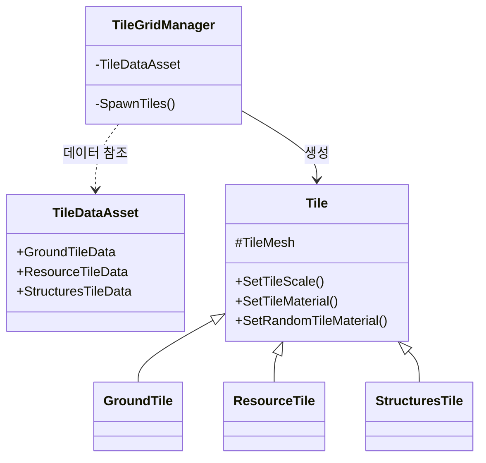
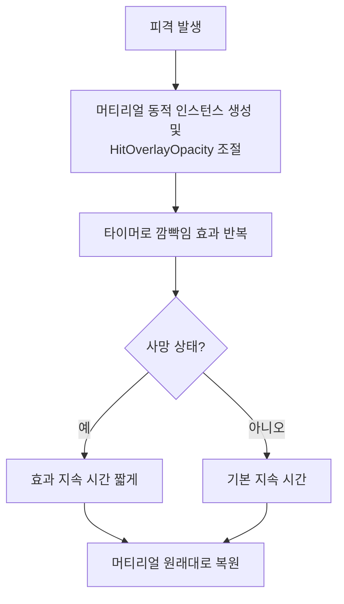
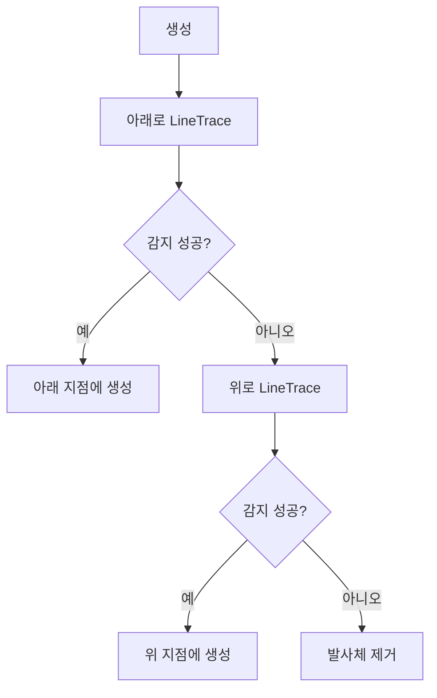
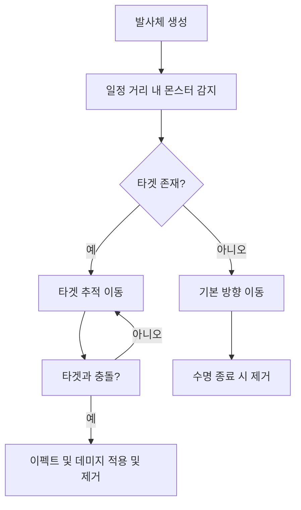
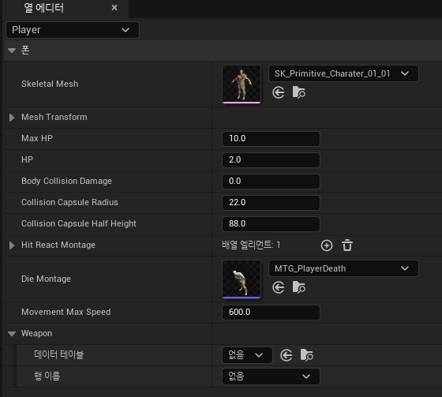

# CavesBasic 개인 프로젝트

## 📑 목차
- [🎮 프로젝트 개요](#-프로젝트-개요)
- [🛠️ 기술 스택](#️-기술-스택)
- [⚡ 빌드 및 실행 방법](#-빌드-및-실행-방법)
- [❗ 실행 전 유의사항](#-실행-전-유의사항)
- [📁 프로젝트 구조](#-프로젝트-구조)
- [📌 주요 기능 요약](#-주요-기능-요약)
- [💡 설계 포인트](#-설계-포인트)
- [🔎 세부 구현 (주요 코드/로직)](#-세부-구현-주요-코드로직)
  - [1. Player](#1-player)
  - [2. Projectile](#2-projectile)
    - [2.1 GroundProjectile](#21-groundprojectile)
    - [2.2 StraightProjectile](#22-straightprojectile)
  - [3. Monster](#3-monster)
- [⚠️ 트러블슈팅 경험 (문제 해결 사례)](#️-트러블슈팅-경험-문제-해결-사례)
- [🖥️ UI](#️-ui)
- [📊 데이터 관리](#-데이터-관리)
- [🌱 회고](#-회고)
- [✉️ Contact](#️-contact)

---

## 🎮 프로젝트 개요
| 항목        | 내용                              |
|-------------|-----------------------------------|
| **장르**        | 탑다운 뷰 판타지 RPG                 |
| **컨셉**        | 어두운 동굴 속 전투와 생존         |
| **목표**        | C++ 및 Unreal Engine 5.4 기반으로, 몬스터와 전투 등 핵심 RPG 시스템 구현 |
| **기간**        | 2024.10.15 ~ 2024.11.15           |
| **개발자**      | 원재민                            |


---

## 🛠️ 기술 스택
- **언어** : C++
- **게임 엔진** : Unreal Engine 5.4
- **버전 관리** : Sourcetree, GitHub
- **IDE** : Visual Studio 2022

---

## ⚡ 빌드 및 실행 방법

1. **필수 환경**
   - Unreal Engine 5.4
   - Visual Studio 2022
   - Windows 10/11 64bit

2. **프로젝트 클론**
    ```bash
    git clone https://github.com/WJMcode/Project_CavesBasic.git
    ```

3. **프로젝트 열기**
   - `CavesBasic.uproject` 파일을 더블 클릭하거나, 언리얼 에디터에서 직접 열기

4. **Visual Studio 프로젝트 생성 및 빌드**
   - `CavesBasic.uproject` 파일 우클릭 → `Generate Visual Studio project files`
   - 생성된 `.sln` 파일을 Visual Studio에서 열고 빌드 실행 (`Ctrl + Shift + B`)

5. **게임 실행**
   - 언리얼 에디터에서 `Play` 클릭

---

## ❗ 실행 전 유의사항
- 빌드 또는 실행 중 오류가 발생할 경우, **`Content` 폴더 경로가 손상되었거나 누락되지 않았는지 확인**하세요.
- 특히 **`.uproject` 파일과 동일한 위치에 `Content` 폴더가 존재해야** 정상적으로 실행됩니다.
  
---

## 📁 프로젝트 구조

```text
Project_CavesBasic/
├── Source/
│   └── CavesBasic/
│   ├── Actors/         # 플레이어, 몬스터 등 주요 액터
│   ├── Components/     # 플레이어 상태 등 기능별 컴포넌트
│   ├── UI/             # 위젯, HUD
│   ├── GameframeWork/  # GameMode 등
│   └── ...
├── Content/            # 언리얼 에셋
└── ...
```

---

## 📌 주요 기능 요약

- **Player**  
  - 4방향 이동, 점프, 웅크리기가 가능합니다.  
  - 무기를 습득하면 고유 스킬을 사용할 수 있습니다.  
  - 피격 시 **무적 상태와 깜빡임 효과**가 적용되며, 사망 시 **리스폰**이 가능합니다.
- **Projectile**
  - **Ground Projectile** : 플레이어 전방의 지형을 **자동 감지**하여, **감지한 지면 위에 생성**됩니다.
  - **Straight Projectile** : 적을 향해 일직선으로 날아가는 **추적형 발사체**입니다.
- **Monster**  
  - 랜덤 AI를 기반으로 움직이며, 사망 시 점진적으로 투명화되어 자연스럽게 제거됩니다.
- **UI**  
  - 플레이어 및 몬스터의 체력바를 표시하며, 사망 시 리스폰 창을 통한 상태 전환을 지원합니다.

---

## 💡 설계 포인트

- **데이터 중심 구조**  
  캐릭터, 몬스터, 무기, 스킬 등의 핵심 데이터를 DataTable 기반으로 관리하여, **확장성과 유지보수에 용이한 구조**로 구현했습니다.

- **Blueprint + C++ 혼용 설계**  
**UI 및 단순 상호작용은 Blueprint**, **핵심 시스템 로직은 C++** 로 분리하여 **개발 효율과 성능**을 모두 고려한 구조입니다.
  
- **에디터 친화적 & 하드코딩 최소화**  
  대부분의 설정을 에디터에서 조정 가능하도록 설계하여, **디자이너 및 기획자와 협업**하기 용이하며 **유연한 밸런싱 조정**이 가능합니다.
 
---
 
## 🔎 세부 구현 (주요 코드/로직)

### 1. Player
  #### **피격 시 시각 효과**  
  - **개요**  
플레이어가 피격되면 Overlay 머티리얼의 Opacity 값을 조정해 **깜빡이는 효과**를 연출합니다.

- **핵심 로직**  


　　　⚬ 피격 시 Overlay 머티리얼을 **동적 인스턴스로 생성**하여 `HitOverlayOpacity` 값을 조절합니다.  
　　　⚬ 타이머를 통해 **깜빡임 효과를 반복**하고, 일정 시간이 지나면 **머티리얼을 원래대로 복원**합니다.  
　　　⚬ 사망 상태일 경우, **효과 지속 시간이 더 짧게 설정**됩니다.

- **설계 장점**
	- 피격 시 시각 효과가 명확하게 표현되어 플레이어는 **위험 상황을 직관적으로 알 수 있습니다.**
	- 사망 시에는 깜빡임 효과가 짧아져 **게임의 몰입감을 높일 수 있습니다.**
<br>

> 📸 아래는 플레이어 피격 시 깜빡임 효과가 적용된 실제 게임 장면입니다.
> <br>
> <br>
> 

<br>

> 📄 아래는 플레이어 피격 시 깜빡임 효과의 핵심 구현 코드입니다.
```cpp
void UCharacterMeshEffect::ApplyHitMaterial(const float Duration)
{
  // 1. Overlay Material을 가져오기
  OriginalOverlayMaterial = TargetMeshComponent->GetOverlayMaterial();
	    
  // 2. Overlay Material을 동적 머티리얼 인스턴스로 변환하여 Opacity 조정
  UMaterialInstanceDynamic* DynOverlayMaterial = UMaterialInstanceDynamic::Create(OriginalOverlayMaterial, this);
  DynOverlayMaterial->SetScalarParameterValue("HitOverlayOpacity", 0.6f);
  TargetMeshComponent->SetOverlayMaterial(DynOverlayMaterial);
	
  // 일정 주기로 깜빡임 효과 타이머 실행
  GetWorld()->GetTimerManager().SetTimer(BlinkTimerHandle, [this, DynOverlayMaterial]()
  {
    BlinkMaterial(DynOverlayMaterial);
  }, Duration / 30.f, true);	       
	
  // 일정 시간 후 머티리얼 원상 복구
  GetWorld()->GetTimerManager().SetTimer(RestoreTimerHandle, [this, DynOverlayMaterial]()
  {
    RestoreOriginalMaterial(DynOverlayMaterial);
    // ... (타이머 정지/멤버 초기화 등 생략)
  }, Duration / 3.f , false);
}
```

>  🔗 전체 코드는 [CharacterMeshEffect.cpp](https://github.com/WJMcode/Project_CavesBasic/blob/main/Source/CavesBasic/Actors/Effect/CharacterMeshEffect/CharacterMeshEffect.cpp)에서 확인하실 수 있습니다.

<br>

### 2. Projectile

  #### **2.1 GroundProjectile**  
  - **개요**  
  플레이어 전방의 지형을 자동으로 감지해, **감지한 지형 위에 생성되는 발사체**입니다.  
                         Skill 데이터 테이블에서 `GroundProjectile`로 지정된 Skill을 사용한 경우에 생성되며 `Floor` 충돌 채널이 적용된 지형만 감지합니다.
- **핵심 로직**

　　　⚬ 지면을 감지하기 위해 **위/아래 방향으로 LineTrace를 시도**합니다.  
　　　⚬ 바닥이 감지되면 해당 위치로 이동해 생성되며, 위/아래 모두에서 감지에 실패한 경우 자동으로 제거됩니다.

- **설계 장점**  
  - 지형 위에 생성되는 **장판형 스킬**, **함정 설치** 등의 기능을 손쉽게 구현할 수 있습니다.  
  - **지형이 없는 잘못된 위치를 자동으로 필터링**하여 **사용자 경험 (UX)** 을 크게 향상시킵니다.
<br>

> 📸 아래는 발사체를 GroundProjectile로 지정된 Skill을 사용한 실제 게임 장면입니다.
> <br>
> <br>
> 

<br>

> 📄 아래는 GroundProjectile의 핵심 구현 코드입니다.
```cpp
void AGroundProjectile::BeginPlay()
{
  const ETraceTypeQuery TraceTypeQuery = UEngineTypes::ConvertToTraceType(ECollisionChannel::ECC_GameTraceChannel5);

  // 아래 아래 방향으로 바닥을 감지
  const bool bDownHit = UKismetSystemLibrary::LineTraceSingle(GetWorld(),
        GetActorLocation(), GetActorLocation() + FVector(0, 0, -350), TraceTypeQuery,
        false, IgnoreActors, EDrawDebugTrace::ForDuration, DownHitResult, true);
  if (bDownHit)
  {
    GroundProjectileLocation.Z = DownHitResult.ImpactPoint.Z;
    SetActorLocation(GroundProjectileLocation);
    return;
  }

  // 위 방향으로 바닥을 감지
  const bool bUpHit = UKismetSystemLibrary::LineTraceSingle(GetWorld(),
        GetActorLocation(), GetActorLocation() + FVector(0, 0, 200), TraceTypeQuery,
        false, IgnoreActors, EDrawDebugTrace::ForDuration, UpHitResult, true);
  if (bUpHit)
  {
    GroundProjectileLocation.Z = UpHitResult.ImpactPoint.Z;
    SetActorLocation(GroundProjectileLocation);
    return;
  }
  
  // 둘 다 실패하면 제거
  Destroy();
}
```

>  🔗 전체 코드는 [GroundProjectile.cpp](https://github.com/WJMcode/Project_CavesBasic/blob/main/Source/CavesBasic/Actors/Projectile/GroundProjectile.cpp)에서 확인하실 수 있습니다.

<br>

  #### **2.2 StraightProjectile**  
  - **개요**  
일정 거리 내 몬스터를 감지하고, **지속적으로 방향을 보정하며 추적 이동**하는 발사체입니다.  
생성 시점에 타겟을 지정하고, 매 프레임 위치를 갱신하며 **유도탄처럼 움직입니다.**  

- **핵심 로직**


　　　⚬ 생성 직후 일정 거리 내에서 몬스터를 감지하고, 타겟으로 설정합니다.  
　　　⚬ 매 프레임마다 타겟 위치를 기준으로 **방향 벡터를 계산**합니다.  
　　　⚬ 해당 방향으로 발사체를 회전시켜 타겟을 추적합니다.  
　　　⚬ ProjectileMovementComponent의 Velocity를 갱신해, **타겟을 향해 정확히 이동**합니다.

- **설계 장점**
  - 단순 직선 궤도가 아닌, **목표를 따라 움직이는 유도 방식**으로 스킬을 쉽게 맞힐 수 있도록 합니다.
  - **ProjectileMovementComponent** 중심으로 구현하여 **엔진 친화적이며 최적화된 구조**입니다.
<br>

> 📸 아래는 발사체를 StraightProjectile로 지정된 Skill을 사용한 실제 게임 장면입니다.
> <br>
> <br>
> 

<br>

> 📄 아래는 StraightProjectile의 핵심 구현 코드입니다.
```cpp
void AStraightProjectile::FollowDamageTarget(AActor* TargetActor)
{
  // 감지된 Actor를 따라가는 함수
  // 타겟 방향을 계산.
  FVector DirectionToTarget = (TargetActor->GetActorLocation() - GetActorLocation()).GetSafeNormal();
	
  // 발사체를 타겟 방향으로 회전시킴.
  FRotator NewRotation = DirectionToTarget.Rotation();
  SetActorRotation(NewRotation);
	
  ProjectileMovementComponent->Velocity = DirectionToTarget * ProjectileData->InitialSpeed;
}
```

>  🔗 전체 코드는 [StraightProjectile.cpp](https://github.com/WJMcode/Project_CavesBasic/blob/main/Source/CavesBasic/Actors/Projectile/StraightProjectile.cpp)에서 확인하실 수 있습니다.

<br>

### 3. Monster

  #### **사망 시 시각 효과**  
  - **개요**  
몬스터가 사망하면 메시의 머티리얼을 **투명도 조절 가능한 머티리얼로 교체**하고,  
**시간에 따라 서서히 사라지집니다.**

- **핵심 로직**  
  - **Translucent 머티리얼을 MaterialInstanceDynamic 형태로 생성**합니다.
  - 몬스터가 사망하면 `OnDisappearMesh` 함수에서 **Opacity** 를 점차 줄입니다.
  - **Timeline**과 **Curve**를 통해 시간에 따른 투명도 조절을 구현합니다.
  - 사라지는 연출이 완료되면 `OnDisappearMeshEnd`에서 Actor를 제거합니다.

- **설계 장점**  
 	- 몬스터가 사망할 때 **서서히 투명해지는 연출**로, 플레이어에게 **명확한 피드백과 몰입감을 제공**합니다.  

<br>

> 📸 아래는 몬스터 사망 시 투명해지는 효과가 적용된 실제 게임 장면입니다.
> <br>
> <br>
> 

<br>

> 📄 아래는 몬스터 사망 시 투명해지는 효과의 핵심 구현 코드입니다.
```cpp
// BeginPlay에서 MaterialInstanceDynamic 초기화
MaterialInstanceDynamics = SkeletalMesh->CreateAndSetMaterialInstanceDynamic(1);

// OnDisappearMesh : Opacity를 줄여 몬스터가 점점 사라지게 함
float NewTransparency = FMath::Max(CurrentTransparency - InDissolve * SpeedMultiplier, 0.0f);
MaterialInstanceDynamics->SetScalarParameterValue(FName("Opacity"), NewTransparency);

// Timeline이 끝나면 Destroy
void ADefaultMonster::OnDisappearMeshEnd() { Destroy(); }
```

>  🔗 전체 코드는 [DefaultMonster.cpp](https://github.com/WJMcode/Project_CavesBasic/blob/main/Source/CavesBasic/Actors/Monster/DefaultMonster/DefaultMonster.cpp)에서 확인하실 수 있습니다.

---

## ⚠️ 트러블슈팅 경험 (문제 해결 사례)
- **Straight Projectile 추적 문제**
  - **문제 배경** : Straight Projectile이 몬스터 가까이에서 생성될 때, 몬스터를 제대로 추적하지 못했습니다.
  - **원인** : 몬스터의 방향이 아니라 위치만 추적하여, 발사체가 올바르게 따라가지 못한 것이 원인이었습니다.
  - **해결 과정** : Tick마다 몬스터의 방향을 체크하고, 발사체를 해당 방향으로 회전시키도록 수정하였습니다.
  - **결과** : 발사체가 몬스터를 지속적으로 정확히 추적해 자연스러운 타격이 가능해졌습니다.

- **몬스터 사망 시 투명화 효과 구현 실패**
  - **문제 배경** : 몬스터 사망 시 점점 투명해지는 효과를 구현하려 했으나, 머티리얼의 Opacity 조정이 불가능했습니다.
  - **원인** : 기존 머티리얼의 블렌드 모드가 Opaque로 설정되어 있었습니다.
  - **시도** : Opacity를 수정할 수 있도록 블렌드 모드를 바꾸어 적용하였으나, 몬스터 외형의 퀄리티가 떨어졌습니다.
  - **해결 과정** : 블렌드 모드가 Translucent인 머티리얼을 별도로 만들어 사망 시에만 교체하고, Opacity 값을 점차 낮추는 방식으로 수정했습니다.
  - **결과** : 몬스터가 사망할 때 자연스러운 시각 효과를 연출할 수 있었습니다.

---

### 🖥️ UI
  - 플레이어가 사망하면 리스폰 창을 활성화하며 리스폰을 진행할 수 있습니다.
                                <br><br>


---

## 📊 데이터 관리

본 프로젝트는 주요 게임 요소(플레이어, 무기, 스킬, 발사체, 이펙트 등)의 속성과 밸런스를  
**코드가 아닌 DataTable**로 관리하여 빠른 수정과 확장, 유지보수가 가능합니다.

- **Player 데이터 테이블**  
플레이어의 주요 능력치, 외형, 무기 장착 정보 등을 관리합니다.
  
    

- **Weapon 데이터 테이블**  
각 무기 외형, 보유 스킬 등 무기 관련 데이터를 관리합니다.

    


- **Skill 데이터 테이블**  
스킬의 피해량, 애니메이션(몽타주), 연동 발사체 등 스킬 정보를 설정합니다.
    
    


- **Projectile 데이터 테이블**  
발사체의 타입, 크기, 스폰 위치, 이동 속도 등 상세 속성을 관리합니다.

    


- **Effect 데이터 테이블**  
각종 이펙트 및 효과음, 데칼 정보 등을 관리합니다.

     


> **구조적 특징** :
> 각 데이터 테이블은 서로 참조합니다.  
> 예를 들어, 무기는 스킬을 참조하고, 스킬은 발사체를, 발사체는 이펙트를 참조하는 구조로 설계되었습니다.  
> 이를 통해 신규 요소 추가, 밸런스 조정, 효과 변경 등을 코드 수정 없이 에디터에서 즉시 반영할 수 있습니다.

---

## 🌱 회고
- **데이터 기반 설계 경험**  
발사체, 무기, 스킬, 이펙트 등 게임의 주요 요소를 `DataTable`로 관리하며 하드코딩을 최소화하고,  
새로운 데이터 추가와 수정이 매우 편리한 구조를 직접 설계하고 구현해볼 수 있었습니다.  

- **문제 해결 역량 강화**  
발사체 추적 로직, 머티리얼 블렌딩 등에서 다양한 문제를 직접 해결하면서 문제 분석력과 디버깅 실력이  
성장했다고 느꼈습니다.

- **개인 프로젝트의 주도적 완성**  
설계, 구현, 테스트 및 디버깅, 문서화까지 모든 과정을 주도적으로 진행하며 핵심 개발 흐름을 직접 경험하였습니다.

- **향후 목표**  
앞으로는 멀티플레이나 더 다양한 콘텐츠 추가 등 한 단계 높은 난이도의 시스템에도 도전하고 싶습니다.

---

### ✉️ Contact

- Email : uoipoip@gmail.com
- GitHub : [WJMcode/Project_CavesBasic](https://github.com/WJMcode/Project_CavesBasic)

---

